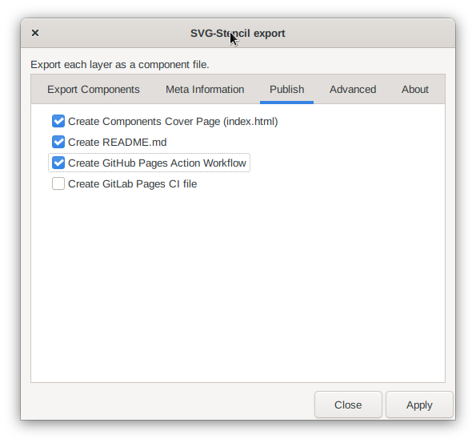

## How to publish a stencil on Github Pages

**Use the [Inkscape
Extension](https://github.com/svg-stencils/inkscape-svg_stencil_export) to create your stencil-directory**. Make sure to check `Create GitHub Pages Workflow` and also create `index.html` and `readme.md`.



On Github [create a new repository](https://github.com/new) and follow instructions to add the contents of your stencil directory to the new repository.

**Make sure to add .github**

```
cd my-repo
git add .github
git commit -m "add github workflow"
git push
```

When the repo is pushed **setup github pages**.


1. Go to the repo settings
2. Go to the pages section
3. Choose the root of the main branch as pages source
4. Thats it, after a few minutes you can click the link and a preview of your stencil should be visible.
